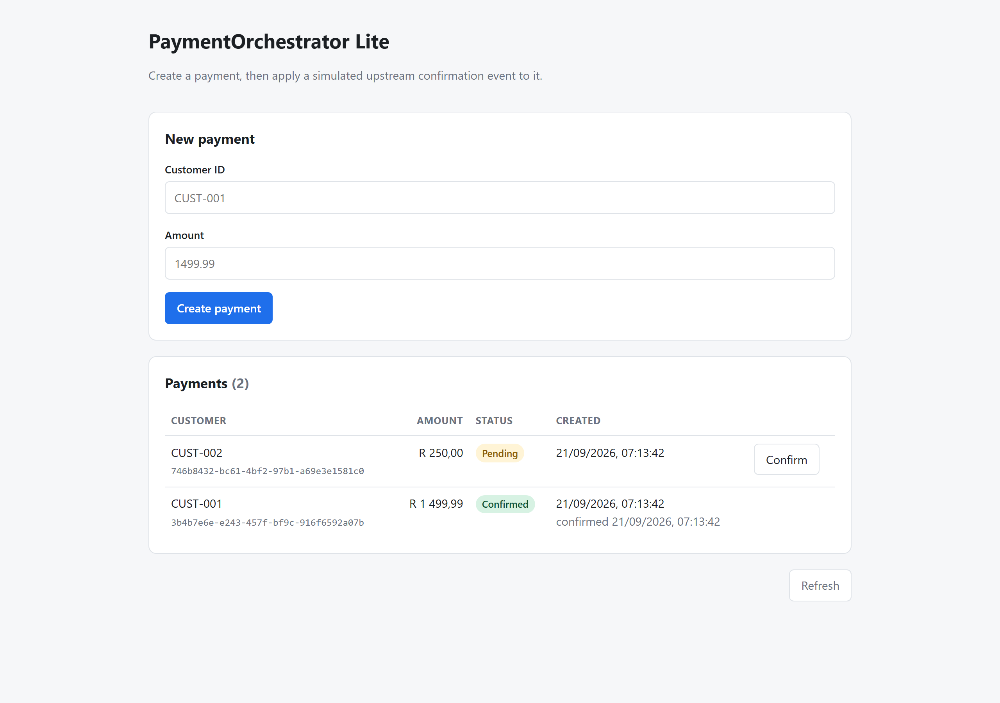
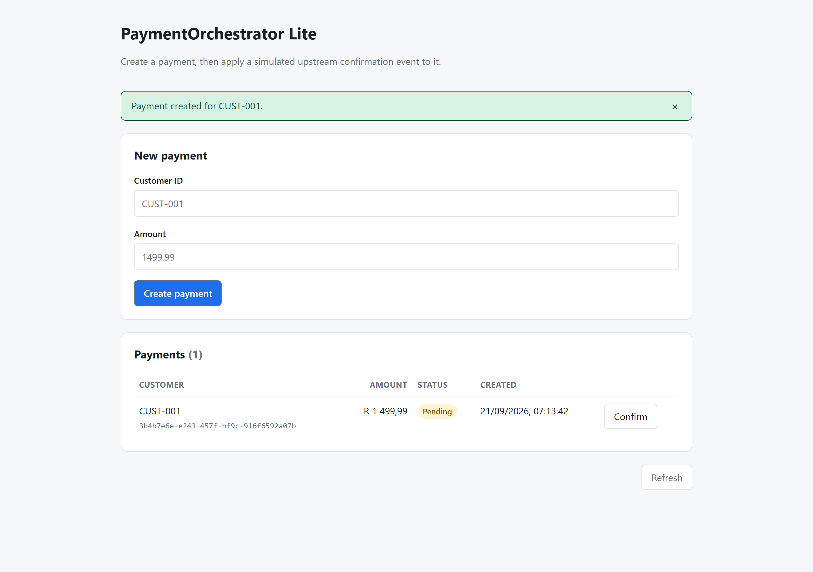
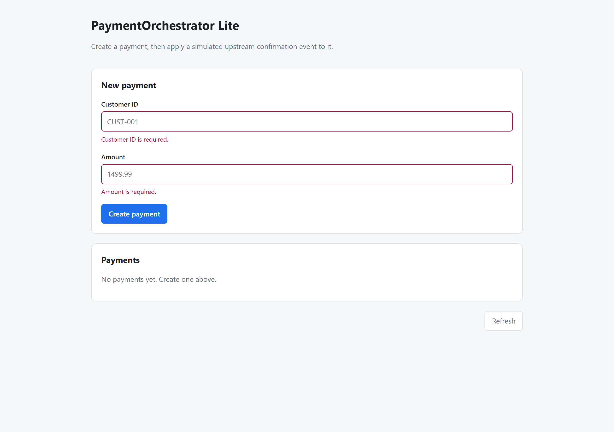
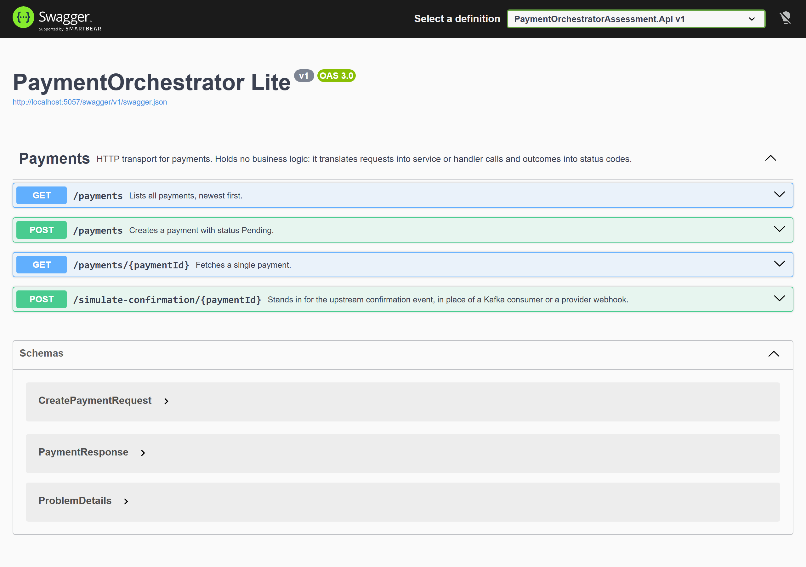

# Payflex Payment Orchestrator

A simplified Buy Now Pay Later payments feature: an ASP.NET Core Web API that stores
payments, a React SPA that creates and views them, and a simulated upstream event that
confirms them.

- **Backend:** .NET 10 Web API, EF Core 10, SQLite
- **Frontend:** React 19 + TypeScript + Vite
- **Tests:** xUnit v3, Moq and Shouldly on the backend; Vitest and Testing Library on the frontend

The design decisions and trade-offs are written up in [docs/design/DESIGN.md](docs/design/DESIGN.md).

---

## Running it

You need the [.NET 10 SDK](https://dotnet.microsoft.com/download) and
[Node.js 24.15 or newer](https://nodejs.org).

### Backend

```bash
dotnet run --project PaymentOrchestratorAssessment.Api --launch-profile http
```

- API: `http://localhost:5057`
- Swagger UI: `http://localhost:5057/swagger`

The SQLite file (`payments.db`) is created on first run inside the Api project folder.
Delete it to start clean. There is no migration step.

### Frontend

In a second terminal:

```bash
cd frontend
npm install
npm run dev
```

Open `http://localhost:5173`.

The API URL is read from `VITE_API_BASE_URL` and defaults to `http://localhost:5057`.
To point it elsewhere, copy `.env.example` to `.env.local` and edit it. If you change
the frontend's port, add the new origin to `Cors:AllowedOrigins` in
`PaymentOrchestratorAssessment.Api/appsettings.json`, otherwise the browser will block
the requests.

### Tests

```bash
dotnet test --project PaymentOrchestratorAssessment.Tests/PaymentOrchestratorAssessment.Tests.csproj
cd frontend && npm run test
```

32 backend tests, 15 frontend tests.

### Regenerating the screenshots

The images in this README are captured from a live run rather than drawn by hand. With
the API already running:

```bash
cd frontend
npx playwright install chromium   # first time only
npm run build
npm run preview                   # serves the built app on http://localhost:4173
npm run screenshots               # in a second terminal
```

The script drives the real UI: it submits an empty form to surface the validation
errors, creates two payments, confirms one, and captures Swagger. Output goes to
`docs/images/`. Start from an empty database (delete `payments.db`) so the list matches
what is shown here. Override the ports with `APP_URL` and `API_URL` if yours differ.

### Docker

```bash
docker compose up --build
curl http://localhost:5057/payments
```

Or directly:

```bash
docker build -f PaymentOrchestratorAssessment.Api/Dockerfile -t payment-orchestrator-api .
docker run --rm -p 5057:8080 payment-orchestrator-api
```

---

## API

| Method | Route                                  | Purpose                                |
| ------ | -------------------------------------- | -------------------------------------- |
| `GET`  | `/payments`                            | List all payments, newest first        |
| `GET`  | `/payments/{paymentId}`                | Fetch one payment                      |
| `POST` | `/payments`                            | Create a payment with status `Pending` |
| `POST` | `/simulate-confirmation/{paymentId}`   | Apply a simulated confirmation event   |

### Sample request

```bash
curl -i -X POST http://localhost:5057/payments \
  -H 'Content-Type: application/json' \
  -H 'Idempotency-Key: 6f1c2f7e-2f1a-4c9e-8c3a-1f2b3c4d5e6f' \
  -d '{
        "customerId": "CUST-001",
        "amount": 1499.99
      }'
```

`201 Created`, with a `Location` header pointing at the new payment:

```json
{
  "id": "7aa4848e-1d59-44aa-bd6a-ade18eb82097",
  "customerId": "CUST-001",
  "amount": 1499.99,
  "status": "Pending",
  "createdAt": "2026-09-20T21:27:12.9130392Z",
  "confirmedAt": null
}
```

### The rest of the calls

```bash
# List
curl http://localhost:5057/payments

# Repeat the create with the same Idempotency-Key.
# 200, the same payment, no second row.
curl -i -X POST http://localhost:5057/payments \
  -H 'Content-Type: application/json' \
  -H 'Idempotency-Key: 6f1c2f7e-2f1a-4c9e-8c3a-1f2b3c4d5e6f' \
  -d '{"customerId":"CUST-001","amount":1499.99}'

# Confirm (substitute the id from the create response)
curl -i -X POST http://localhost:5057/simulate-confirmation/7aa4848e-1d59-44aa-bd6a-ade18eb82097

# Confirm again. 200, unchanged, and confirmedAt does not move.
# Duplicate events are a no-op, not an error.
curl -i -X POST http://localhost:5057/simulate-confirmation/7aa4848e-1d59-44aa-bd6a-ade18eb82097

# Unknown payment. 404 with a ProblemDetails body.
curl -i -X POST http://localhost:5057/simulate-confirmation/00000000-0000-0000-0000-000000000000

# Validation failure. 400 with a ValidationProblemDetails body.
curl -i -X POST http://localhost:5057/payments \
  -H 'Content-Type: application/json' \
  -d '{"customerId":"","amount":0}'
```

---

## Project layout

```
PaymentOrchestratorAssessment.Core/            Domain. The Payment entity, its states,
                                               and the inbound event contract. No dependencies.
PaymentOrchestratorAssessment.Application/     Use cases and the interfaces they depend on.
                                               PaymentService, PaymentEventHandler, DTOs,
                                               IPaymentRepository.
PaymentOrchestratorAssessment.Infrastructure/  EF Core and SQLite. PaymentsDbContext and the
                                               IPaymentRepository implementation.
PaymentOrchestratorAssessment.Api/             HTTP only. Program.cs, PaymentsController, Dockerfile.
PaymentOrchestratorAssessment.Tests/           xUnit v3. Moq over the Application layer,
                                               real SQLite over Infrastructure.
frontend/                                      React 19 + Vite SPA.
```

Dependencies point inward: Api to Infrastructure to Application to Core. The Application
layer names `IPaymentRepository` and Infrastructure implements it, so the use cases can
be tested without a database.

---

## Architecture in one page

Full reasoning is in [docs/design/DESIGN.md](docs/design/DESIGN.md). The three decisions
that matter most:

**The confirmation endpoint is a transport, not the logic.**
`POST /simulate-confirmation/{paymentId}` does not change state itself. It builds a
`PaymentConfirmationReceived` event and hands it to `IPaymentEventHandler`. That handler
is what a Kafka consumer, an SQS listener or a provider webhook would call after
deserialising a message. Replacing the simulation with a real consumer means adding a
consumer class and deleting an endpoint, with no business logic moving.

**Confirmation is idempotent, and the database enforces it.**
Upstream payment events are delivered at-least-once, so the same confirmation arriving
twice is normal traffic rather than a fault. The state change is a single conditional
update filtered on `Status = 'Pending'`, which is atomic, so a duplicate affects zero
rows and `ConfirmedAt` is never overwritten. A duplicate answers `200`, not an error.
Only an unknown payment answers `404`.

**Create is idempotent too, optionally.**
`POST /payments` accepts an `Idempotency-Key` header. A partial unique index on the
column is what actually guarantees one payment per key: two concurrent requests cannot
both insert, and the loser returns the winner's payment. The frontend generates a key
per submission and disables the submit button while a request is in flight.

---

## Continuous integration

Two workflows, both on push and pull request against `master`:

- **`.github/workflows/dotnet.yml`** restores, builds in Release and runs the 32 backend
  tests, then builds the API container image and smoke tests it through create, confirm,
  duplicate confirm and unknown id.
- **`.github/workflows/frontend.yml`** runs `npm ci`, the typecheck, the 15 Vitest tests
  and the production build, and uploads `dist` as an artifact.

---

## Evidence of application success

The images below are captured from a real run by
`frontend/scripts/capture-screenshots.mjs`, which drives the built SPA against the
running API with Playwright. They are evidence, not mockups. To regenerate them, see
[Regenerating the screenshots](#regenerating-the-screenshots).

A payment in each state. The newest is `Pending` and offers a Confirm button; the
confirmed one records when the event was applied:



Creating a payment shows a success notification and the new row, with amounts formatted
as currency and timestamps rendered in the viewer's local time zone:



Client-side validation mirrors the server's rules, so the common mistakes are caught
without a round trip:



Swagger UI, with the endpoint descriptions coming from the XML documentation comments
on the controller:



### The API behind those screens

Create returns `201` with a `Location` header and status `Pending`:

```
HTTP/1.1 201 Created
Location: http://localhost:5057/payments/7aa4848e-1d59-44aa-bd6a-ade18eb82097
{"id":"7aa4848e-1d59-44aa-bd6a-ade18eb82097","customerId":"CUST-SPA","amount":250.00,
 "status":"Pending","createdAt":"2026-09-20T21:27:12.9130392Z","confirmedAt":null}
```

After confirming, the payment carries the state change and the time it happened. Both
timestamps are UTC and marked as such, so the browser renders them in the viewer's local
zone rather than misreading them:

```json
[
  {
    "id": "7aa4848e-1d59-44aa-bd6a-ade18eb82097",
    "customerId": "CUST-SPA",
    "amount": 250.0,
    "status": "Confirmed",
    "createdAt": "2026-09-20T21:27:12.9130392Z",
    "confirmedAt": "2026-09-20T21:29:18.7997246Z"
  }
]
```

Repeating the create with the same `Idempotency-Key` returns `200` and the same id, and
the list still holds one row. Repeating the confirmation returns `200` with `confirmedAt`
unchanged. An unknown payment returns `404` and an invalid body returns `400`, both as
`ProblemDetails`.

---

## Known trade-offs

Deliberate simplifications rather than oversights. Each is explained in
[docs/design/DESIGN.md](docs/design/DESIGN.md).

- `EnsureCreated()` instead of migrations, so a reviewer does not need the `dotnet-ef` tool
- `decimal` is stored as `TEXT` by the SQLite provider, so ordering by amount in SQL would
  sort lexicographically. Nothing here does, but it is a reason SQLite is a development
  convenience rather than the production database
- Event dispatch is synchronous and in-process
- No authentication
- No pagination on `GET /payments`
- The frontend re-fetches the list after each mutation rather than patching local state
